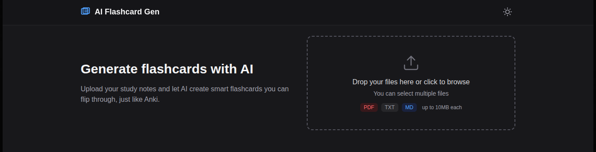

# AI Flashcard Gen



Smart flashcard generator optimized for spaced repetition from any study material. Built for anyone who studies — whether you're a student, a professional learning new skills, or a curious mind exploring new topics. Drop your material in any format, receive ready-to-use flashcards.

## Idea

Upload your study material and the system will:
1. Extract key concepts from the source (PDF, handwritten notes, audio, or plain text)
2. Generate question/answer pairs as flashcards
3. Optimize flashcards for retention using spaced repetition principles
4. Export in formats compatible with Anki and other apps

## Supported inputs

| Input type | How it works |
|------------|--------------|
| **PDF documents** | Direct text extraction from any PDF file |
| **Handwritten notes** | OCR converts photos of handwritten notes into text |
| **Other text formats** | Support for .txt, .md, .docx and other common formats |

No matter how you take notes — typing or writing by hand — the tool adapts to your workflow.

## Use cases

| Scenario | Input | Output |
|----------|-------|--------|
| Preparing a biology exam | 40-page chapter PDF | 50 flashcards with concepts, definitions and relationships |
| Learning English vocabulary | Article from The Guardian | Cards with words in context, meaning and usage examples |
| Studying for AWS certification | Official documentation PDF | Flashcards per service with exam-style questions |
| Reviewing a research paper | Paper from arxiv | Cards with hypothesis, methodology, key findings and limitations |
| Quick review after class | Photo of handwritten notes | Cards with key concepts extracted via OCR |

## Roadmap

### Phase 1 - MVP
- [ ] Text extraction from PDF
- [ ] Prompt engineering to generate flashcards from text
- [ ] Basic JSON/CSV output
- [ ] End-to-end working script

### Phase 2 - Multi-format input
- [ ] OCR for handwritten notes (image to text)
- [ ] Support for .txt, .md, .docx formats

### Phase 3 - UI & Improvements
- [ ] Interface for file uploads
- [ ] Difficulty and flashcard count selector
- [ ] Flashcard preview before export
- [ ] Anki export format (.apkg)

### Phase 4 - Intelligence
- [ ] Automatic topic and subtopic detection
- [ ] Flashcard generation with visual context (diagrams, tables)
- [ ] Quiz mode with multiple choice questions
- [ ] Difficulty analysis per concept

## Structure

```
AI-Flashcard-Gen/
├── src/              # Source code
├── data/             # Test files and generated outputs
│   └── samples/      # Example inputs (OCR, screenshots)
├── docs/             # Project documentation
└── README.md
```

## Future vision

In a later stage of the project, we plan to scale the application by integrating a multimodal generative model. This will allow the AI to process not only text, but also images, diagrams and drawings. A student will be able to capture a handwritten note, a visual sketch or a diagram, and the AI will automatically extract key concepts, generating flashcards from any format. This evolution will make learning truly multimodal, breaking format barriers and offering a comprehensive study experience adaptable to any need.
